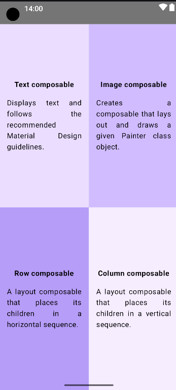

# Compose Quadrant App

This project is an Android application built using Jetpack Compose. It demonstrates a quadrant layout with four composable cards, each displaying a title and a description. The app leverages Jetpack Compose's powerful UI toolkit to create a responsive, modern design.

## Output

*Screenshot of the Compose Quadrant App showing the quadrant layout with four composable cards.*

## Features

- **Jetpack Compose**: The entire UI is built using Jetpack Compose, offering a declarative approach to building Android UIs.
- **Quadrant Layout**: The app is divided into four quadrants, each displaying a different composable card with a unique background color, title, and description.
- **Material Design**: Uses Material 3 components and themes for a consistent and modern look.

## Components

### MainActivity

`MainActivity` is the entry point of the app. It sets up the Compose environment and applies the `ComposeQuadrantTheme`. The `Scaffold` composable is used as the base layout, which hosts the `Quadrants` composable.

### Quadrants

The `Quadrants` composable arranges four `ComposableInfoCard` components into two rows with two cards each, creating a quadrant layout. Each card is given equal weight to ensure the layout is balanced.

### ComposableInfoCard

The `ComposableInfoCard` is a reusable composable that displays a title and a description, with a customizable background color. It is arranged using `Column`, with centered alignment both vertically and horizontally.

### Preview

`GreetingPreview` provides a preview of the `Quadrants` composable within the Android Studio preview window, enabling you to see how the UI looks without running the app on a device or emulator.

## How to Run

1. Clone the repository.
2. Open the project in Android Studio.
3. Sync the project with Gradle files.
4. Run the project on an Android emulator or a physical device.

## License

[License](https://www.apache.org/licenses/LICENSE-2.0)

## Resources

- **Jetpack Compose Documentation**: [Official Docs](https://developer.android.com/jetpack/compose/documentation)
- **Material Design**: [Material Design Guidelines](https://material.io/design)

## Credits

- **Project Development**: [Harmandeep](mailto:sharmandeep954@gmail.com)

## Contributing

Contributions are welcome! Please feel free to submit a Pull Request or open an Issue for any improvements or bug fixes.

## Connect with Me

- [LinkedIn](https://www.linkedin.com/in/harmandeep-87032918b/)
- [GitHub](https://github.com/Harmandeep01/)

